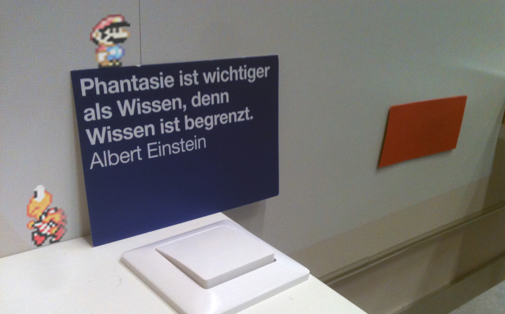

SuperMarioCV
============

Spatial Augmented Reality based Super Mario Bros game. 

This prototype uses the real world as a game scenario, proposing an interactive videogame level editor that allows users to interact with their own environment to create game content with real every-day objects in real time.

## Credits

Concepted and developed for the [TEI'14](http://tei-conf.org/14/) Student Design Challenge by Patrick Oswald, Kien Nguyen Canh and Jordi Tost with the support of Prof. Reto Wettach in the course _Forschendes Lernen: Be-greifbare Interaktion_ (WS1314, University of Applied Sciences Potsdam). The project won the Best Tech Award. See the [TEI'14 website](http://tei-conf.org/14/design.php) for more information.

## Implementation

Developed with [Processing](http://processing.org/) and the computer vision library [OpenCV for Processing](https://github.com/atduskgreg/opencv-processing) by Greg Borenstein.

## Copyright

Super Mario Bros.® is a registered trademark of Nintendo®. Super Mario Bros.® characters are copyright of Nintendo®. 

The purpose of this prototype is absolutely academic and non-commercial.

## License

The code in this repository is available under the [MIT License](https://en.wikipedia.org/wiki/MIT_License).

Copyright (c) 2014 - Jordi Tost, University of Applied Sciences Potsdam

Permission is hereby granted, free of charge, to any person obtaining a copy of this software and associated documentation files (the "Software"), to deal in the Software without restriction, including without limitation the rights to use, copy, modify, merge, publish, distribute, sublicense, and/or sell copies of the Software, and to permit persons to whom the Software is furnished to do so, subject to the following conditions:

The above copyright notice and this permission notice shall be included in all copies or substantial portions of the Software.

THE SOFTWARE IS PROVIDED "AS IS", WITHOUT WARRANTY OF ANY KIND, EXPRESS OR IMPLIED, INCLUDING BUT NOT LIMITED TO THE WARRANTIES OF MERCHANTABILITY, FITNESS FOR A PARTICULAR PURPOSE AND NONINFRINGEMENT. IN NO EVENT SHALL THE AUTHORS OR COPYRIGHT HOLDERS BE LIABLE FOR ANY CLAIM, DAMAGES OR OTHER LIABILITY, WHETHER IN AN ACTION OF CONTRACT, TORT OR OTHERWISE, ARISING FROM, OUT OF OR IN CONNECTION WITH THE SOFTWARE OR THE USE OR OTHER DEALINGS IN THE SOFTWARE.
